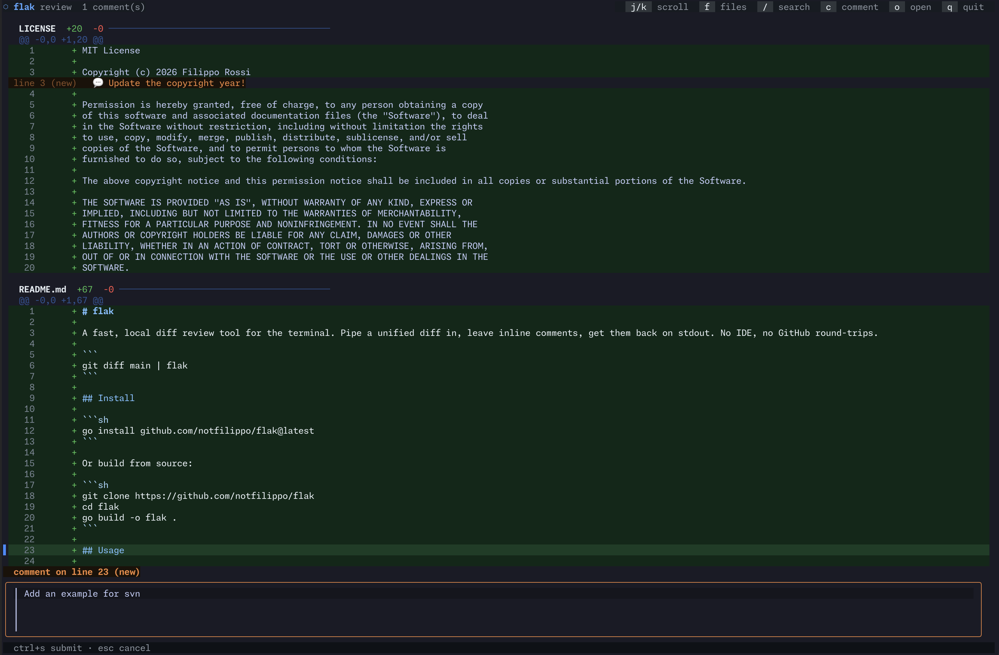

# flak



A fast, local diff review tool for the terminal. Pipe a unified diff in, leave inline comments, get them back on stdout. No IDE, no GitHub round-trips.

```
git diff main | flak
```

## Install

```sh
go install github.com/notfilippo/flak@latest
```

Or build from source:

```sh
git clone https://github.com/notfilippo/flak
cd flak
go build -o flak .
```

## Usage

```sh
# Review staged changes
git diff --cached | flak

# Review against a branch
git diff main..HEAD | flak

# Works with jj too
jj diff -r @ --git | flak
```

When done, comments are printed to stdout:

```
=== flak review comments ===

src/main.go:42 (new)
Rename this variable, "x" is too generic here.

src/server.go:15 (new)
This function is doing too much. Split out the auth logic.

=== end ===
```

If you leave no comments: `=== flak review: LGTM (no comments) ===`

## Keybindings

| Key                    | Action                                           |
| ---------------------- | ------------------------------------------------ |
| `j` / `k` or `↑` / `↓` | Scroll line by line                              |
| `ctrl+d` / `ctrl+u`    | Scroll half page                                 |
| `g` / `G`              | Jump to top / bottom                             |
| `]` / `[`              | Next / previous file                             |
| `f`                    | Fuzzy file picker                                |
| `/`                    | Search (confirm with `enter`, cancel with `esc`) |
| `n` / `N`              | Next / previous search match                     |
| `c`                    | Add inline comment on current line               |
| `e`                    | Edit comment under cursor                        |
| `x`                    | Delete comment under cursor                      |
| `o`                    | Open current file in `$EDITOR`                   |
| `q`                    | Quit and print comments                          |
